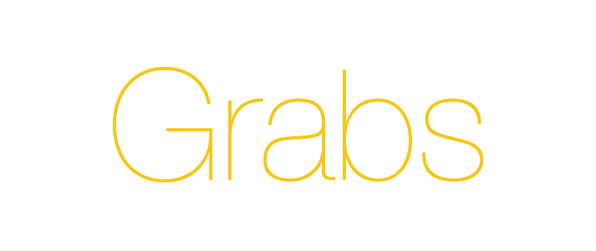

## Grabs: Front-End Development Environment

Your development environment is ready in seconds.

- You can add any task to your project with `Grunt` plugins.
- You can immediately start developing your project with `Angular` support.
- You can download 3rd party libraries with `Bower`.
- You can compile and compress `Stylus` files to CSS files.

## Getting Started

Grabs eases your development process by including the most popular tools and libraries that are mostly needed for a development environment and allow you to easily extend with new capabilities.

In order to use Grabs, [Node.js](http://nodejs.org), [Npm](https://www.npmjs.org/) and [Grunt](http://gruntjs.com). By applying the steps down below your development environment will be ready to use.

### Install

Steps:

1. `git clone https://github.com/sercaneraslan/grabs.git`
1. `cd grabs`
1. `./grabs install`

The Yeoman way:

1. `npm install -g generator-grabs`
1. `yo grabs`

Yes, that is all.

### Features

#### GRUNT
You can add Grunt plugins to add more tasks to your project. You can also change the existing configurations from the **gruntfile.js** file.

#### ANGULAR
Grabs comes with AngularJS. HTML5 Push State support is active and configurations are done so that all the requests are to the **index.html** file. You can change this behavior in **app/js/config/ng-config.js** file.

#### BOWER
With Bower you can manage your external dependencies automatically. All you need to do to get them is to edit **bower.json** file and issue **./grabs bowercopy** command. You can also change the configuration from **gruntfile.js** file's **bowercopy** section.

#### STYLUS
Your Stylus files are automatically compiled to CSS and minified. You can configure this behavior in **gruntfile.js** under **stylus** section.

#### SPRITE
This plugin combines images under **app/img/sprite** disrectory into **sprite.png** file and without any other interference on your part your CSS styles are produced to use this sprite file instead of the individual image file you wrote in your Stylus file. 

Images under **app/img/sprite-retina** directory are combined as **sprite-retina.png** to help you support devices with higher pixel density. Other directories are copied into **build** directory without any processing. 

You can change these settings from **gruntfile.js** under **sprite** section. Example: app/css/global.styl.

#### DEVELOPMENT MODE
In development mode CSS, HTML and JavaScript files are not minimized or combined. Also images are not compressed. When you use **./grabs** command without any arguments, it starts in development mode.

#### LIVE MODE
In Live mode HTML, CSS and JavaScript files are minimized. CSS and JavaScript files are combined into a single CSS and JavaScript file. Images are compressed. File caching is disabled. You can use Live mode by issuing **./grabs live** command.

#### CODE COMPLEXITY REPORT
Plato produces a complexity report of the JavaScript files in your project. You can change these settings from **gruntfile.js** under **plato** section. You can get the report by issuing **./grabs report** command.

#### HTML COMPRESS
Your HTML files are compressed while being delivered. You can change these settings from **gruntfile.js** under **htmlmin** section.

#### IMAGE COMPRESS
Your images are compressed automatically. You can change these settings from **gruntfile.js** under **imagemin** section.

#### JAVASCRIPT MINIMIZATION
Your JavaScript files are minimized with SourceMap support. You can change these settings from **gruntfile.js** under **uglify** section.

#### NOTIFICATION
Grunt will notify you when errors occur via your operating system's notification system. You can define notifications for tasks that you want. You can change these settings from **gruntfile.js** under **notify_hooks** section.

#### CACHE
Adding a timestamp to the resulting CSS, HTML, JavaScript and Image sprite files' names allows bypassing your browser's cache. For example: **app.min.1408295277445.css**

#### SERVER
Provides a basic server. You can change these settings from **gruntfile.js** under **connect** section.

#### LIVERELOAD
Whenever an HTML, CSS or JavaScript file changes your browser window will be automatically refreshed. You can change these settings from **gruntfile.js** under **connect** section.

#### MULTILANGUAGE SUPPORT
Add multiple languages to your project. Checkout **homepage**.

#### ECMASCRIPT 6
With the command of **./grabs es6** you can easily convert existing JavaScript codes from ECMAScript 6 to ECMAScript 5 automatically. You should also define your settings via **traceur** section which resides at **gruntfile.js** file.

#### ESLINT
ESLint, checks your JavaScript files against a standart list of rules for high quality code. You can change these settings from **.eslintrc** under **rules** section.

### License

MIT License
